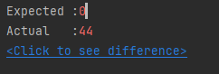
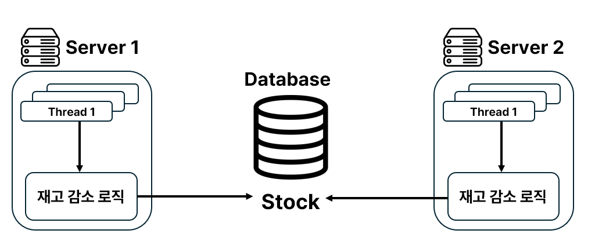

## 🛒📦재고시스템으로 알아보는 동시성 이슈 해결 방법

## Repository Method
### save()와 saveAndFlush()
- Spring Data JPA에서 엔티티를 저장할 때 사용하는 메서드
- 작동 방식의 차이가 존재

#### save()
- 트랜잭션이 끝날 때 까지 영속성 컨텍스트에 저장된 상태로 유지
- 즉시 데이터베이스에 반영❌, 영속성 컨텍스트가 Flush될 때 반영
- 트랜잭션이 끝날 때 한꺼번에 반영되므로 성능이 최적화 됨(Batch Insert⭕)

#### saveAndFlush()
- 즉시 데이터베이스에 반영됨(즉시 Flush 발생)
- 영속성 컨텍스트를 강제로 비우지 않음, 하지만 변경 사항을 DB에 반영함
- 이후 트랜잭션이 종료될 때 다시 Flush가 발생할 수 있음  
💡 `saveAndFlush()`를 불필요하게 사용하면 성능 저하(DB I/O 증가)

## 재고 감소 로직 작성
📂`Stock.java`
```java
@Entity
@Getter
@NoArgsConstructor
public class Stock {

    @Id
    @GeneratedValue(strategy = GenerationType.IDENTITY)
    private Long id;

    private Long productId;

    private Long quantity;

    public Stock(Long productId, Long quantity) {
        this.productId = productId;
        this.quantity = quantity;
    }

    // 재고 수량 감소 메서드
    public void decreaseQuantity(Long quantity) {
        if (this.quantity - quantity < 0) {
            throw new RuntimeException("재고는 0개 미만이 될 수 없습니다.");
        }

        this.quantity -= quantity;
    }
}
```

📂`StockService.java`
```java
@Service
@Transactional
@RequiredArgsConstructor
public class StockService {

    private final StockRepository stockRepository;

    public void decreaseStock(Long id, Long quantity) {
        // Stock을 조회
        // 재고 감소
        // 갱신된 값을 저장
        Stock stock = stockRepository.findById(id)
                .orElseThrow(() -> new IllegalArgumentException("존재하지 않는 id입니다."));

        stock.decreaseQuantity(quantity);
        stockRepository.saveAndFlush(stock);
    }
}
```

📂`StockServiceTest.java`
```java
@SpringBootTest
class StockServiceTest {

    @Autowired
    private StockService stockService;

    @Autowired
    private StockRepository stockRepository;

    // 테스트 전 상품 재고 입력
    @BeforeEach
    public void beforeTest() {
        stockRepository.saveAndFlush(new Stock(1L, 100L));
    }

    // 테스트 후 모든 재고 삭제
    @AfterEach
    public void afterTest() {
        stockRepository.deleteAll();
    }

    @Test
    @DisplayName("재고 감소 로직 테스트")
    public void decreaseStockTest(){

        // when
        stockService.decreaseStock(1L, 1L);

        // then
        Stock stock  = stockRepository.findById(1L)
                .orElseThrow(() -> new IllegalArgumentException("존재하지 않는 id"));

        assertAll(
                () -> assertNotNull(stock),
                () -> assertEquals(99, stock.getQuantity())
        );
    }
}
```

## 재고 감소 로직의 문제점
### 📍 Race Condition
- `Race Condition`은 **여러 개의 프로세스 또는 스레드가 공유 자원에 동시 접근(변경)** 할 때  
발생하는 문제로, 실행 순서에 따라 **예상치 못한 결과가 발생**하는 상태

### 재고 감소 예상 동작 과정
| Thread1                                           | Stock                | Thread2                                                    |
|---------------------------------------------------|----------------------|------------------------------------------------------------|
| SELECT * <br/>FROM stock <br/> WHERE id = 1       | {id: 1, quantity: 5} |                                                            |
| UPDATE SET quantity = 4<br/> FROM stock <br/> WHERE id = 1 | {id: 1, quantity: 4} |                                                            |
|                                                   | {id: 1, quantity: 4} | SELECT * <br/>FROM stock <br/> WHERE id = 1                |
|                                                   | {id: 1, quantity: 3} | UPDATE SET quantity = 4<br/> FROM stock <br/> WHERE id = 1 |

### 재고 감소 실제 동작 과정
- `Thread1`이 데이터를 가져서 갱신하기 전에 `Thread2`가 데이터를 가져가서 갱신
- `Thread1`과 `Thread2`가 모두 갱신을 하지만, 둘 다 재고가 5인 값을 갱신하므로 **갱신이 누락**됨 

| Thread1                                                    | Stock                | Thread2                                                    |
|------------------------------------------------------------|----------------------|------------------------------------------------------------|
| SELECT * <br/>FROM stock <br/> WHERE id = 1                | {id: 1, quantity: 5} |                                                            |
|                                                            | {id: 1, quantity: 5} |  SELECT * <br/>FROM stock <br/> WHERE id = 1                                                            |
| UPDATE SET quantity = 4<br/> FROM stock <br/> WHERE id = 1 | {id: 1, quantity: 4} |              |
|                                                            | {id: 1, quantity: 4} | UPDATE SET quantity = 4<br/> FROM stock <br/> WHERE id = 1 |

## 해결 방법
- 하나의 Thread가 작업이 완료된 이후에, 다른 스레드가 데이터에 접근할 수 있도록 해야 함
- 구체적으로 어떻게 ?
---
### ✨ 해결 방법1. *- Java synchronized*
- `synchronized` 키워드를 메서드 선언부에 붙여, 해당 메서드는 하나의 스레드만 접근 가능하도록 함
```java
    @Transactional
    public synchronized void decreaseStock(Long id, Long quantity) {
        Stock stock = stockRepository.findById(id)
                .orElseThrow(() -> new IllegalArgumentException("존재하지 않는 id입니다."));

        stock.decreaseQuantity(quantity);
        stockRepository.saveAndFlush(stock);
    }
```
### ✨ 해결 방법1. 테스트 결과 
❌테스트 실패 .. ! ! ! !❌



## 테스트 실패 원인
- `synchronized` 키워드를 사용해 문제를 해결하려고 했으나, 테스트에 실패했다.
- 실패 원인은 `@Transactional`의 동작 방식

### @Transactional의 동작 방식
- `@Transactional`을 사용하면 Spring이 해당 메서드를 감싼 **프록시(proxy) 객체**를 생성해 트랜잭션을 관리
  - `StockService`를 필드로 가지는 클래스를 새로 만들어서 실행
- 트랜잭션을 시작되면 해당 메서드의 실행이 끝날 때까지 DB 변경 즉시 반영❌
  - 트랜잭션이 끝나는 시점에서 DB에 한꺼번에 반영(`commit`)
  - 즉, `decreaseStock()`이 실행되어도 실제 DB에는 변경 사항이 반영되지 않은 상태 
  - `decreaseStock()`이 완료되고 실제 DB에 업데이트 되기 전에 다른 스레드가 `decreaseStock()`을 호출
  - 다른 스레드는 갱신되기 전에 값을 가져가서 이전과 동일한 문제가 발생
- `@Transactional`을 제거하고 테스트하면 테스트 성공

### synchronized의 동작 방식
- `synchronized` 키워드는 같은 인스턴스에서 실행되는 여러 스레드가  
하나씩 순차적으로 메서드를 실행하도록 보장
- 그러나`synchronized`는 동일한 인스턴스를 기준으로 동기화가 작동하는데,   
`@Transactional`이 적용되면 프록시 객체가 개입하여 다른 인스턴스를 사용할 수도 있음 *- 뭔 말임?*
- 즉, `synchronized`가 원래 의도대로 작동하지 않을 가능성⭕

## ✨ @Transactional과 synchronized의 충돌
> `synchronized`는 동일한 인스턴스를 기준으로 동기화가 작동하는데,   
`@Transactional`이 적용되면 프록시 객체가 개입하여 다른 인스턴스를 사용할 수도 있음

### 1. synchronized는 같은 인스턴스에서만 작동

- `synchronized`는 **동일한 객체에 대해 동기화를 보장**한다.
  - 즉, 같은 객체를 공유하는 여러 스레드가 접근할 때만 동기화되고  
  다른 객체에서 호출하면 `synchronized` 적용❌
  - 여러 스레드가 같은 `StockService` 인스턴스를 사용하면  
  `synchronized` 덕분에 한 번에 한 스레드만 `decreaseStock()`실행 가능
- **즉, 인스턴스가 다르면 동기화가 적용되지 않는다**❗❗❗

### 2. @Transactional이 프록시 객체를 생성
- 스프링에서 `@Transactional`을 사용하면, **스프링 AOP가 개입**함
- 스프링은 **프록시(proxy) 객체를 생성해서 원본 객체를 감싸고 트랜잭션을 관리**
- 즉 `StockService`를 직접 사용하는 것이 아닌, **스프링이 StockService를 감싼 프록시 객체를 대신 실행**

### 3. proxy객체와 synchronized의 충돌
- `synchronized`는 동일한 객체를 기준으로 동작해야 하는데,  
스프링이 **프록시 객체를 사용하면서 원본 객체와 다를 수 있음**

#### 📍 `stockService.decreaseStock()`을 호출할 때
1. 스프링이 만든 프록시 객체가 먼저 실행
2. 프록시 객체가 원본 `stockService`의 `decreaseStock()`을 실행
3. 그러나 `synchronized`는 프록시 객체가 아닌 원본 객체 기준으로 동작

- 결과적으로 여러 스레드가 각각 다른 프록시 객체를 통해 메서드를 호출하면  
`synchronized`가 제대로 동작하지 않을 수 있음
- `synchronized`가 원본 객체를 기준으로 동기화하려고 하지만  
`@Transactonal`이 적용되면서 프록시 객체가 실행되므로  
동일한 객체가 아닐 가능성이 있어 `synchronized`가 깨질 수 있음

---

## synchronized 사용의 문제점
- `synchronized`는 하나의 프로세스 안에서만 보장
- 서버가 1대일 떄는 데이터 접근을 서버 1대만 해서 괜찮겠지만,  
서버가 2대 혹은 그 이상인 경우 데이터 접근을 여러 대에서 할 수 있게 됨
- 실제 운영 서비스는 대부분 2대 이상의 서버를 사용 *- `synchronized` 사용 거의 ❌*



| Time  | Server 1                                                | Stock                | Server 2                                 |
|-------|---------------------------------------------------------|----------------------|------------------------------------------|
| 10:00 | SELECT *<br/>FROM stock<br/>WHERE id = 1                | {id: 1, quantity: 5} |                                          |
|       |                                                         | {id: 1, quantity: 5} | SELECT *<br/>FROM stock<br/>WHERE id = 1 |
| 10:05 | UPDATE SET quantity = 4<br/>FROM stock<br/>WHERE id = 1 | {id: 1, quantity: 4} |                                          |
|       |                                                         | {id: 1, quantity: 4} | UPDATE SET quantity = 4<br/>FROM stock<br/>WHERE id = 1                                         |
